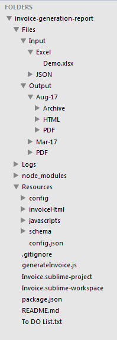

# invoice-generation-report

The objective of this code base is to automate the generation of the invoice based on the excel (XLS/XLSX). The utility is build on NodeJS and uses multiple mpm modules to achive the goal (listed below).

## NPM Installed

1. **Date Format**
	1. Reference: https://www.npmjs.com/package/dateformat
	2. Version: 2.0.0
	3. Uses: Used to format the date time. Required for making the archive file name, format the month of processing etc.
2. **Excel JS**
	1. Reference: https://www.npmjs.com/package/exceljs
	2. Version: 0.2.32
	3. Uses: Used to read the input excel data.
3. **FS Extra**
	1. Reference: https://www.npmjs.com/package/fs-extra
	2. Version: 2.0.0
	3. Uses: Used for copy and move functionality of the document.
4. **Handlebars**
	1. Reference: https://www.npmjs.com/package/handlebars
	2. Version: 4.0.6
	3. Uses: Used to generate the invoice HTML using the data received in Excel.
5. **Minimist**
	1. Reference: https://www.npmjs.com/package/minimist
	2. Version: 1.2.0
	3. Uses: Used to format the argument received.
6. **Promise**
	1. Reference: https://www.npmjs.com/package/promise
	2. Version: 7.1.1
	3. Uses: Used to force the function call synchronously instead of asynchronously.
7. **Underscore**
	1. Reference: http://underscorejs.org/
	2. Version: 1.8.3
	3. Uses: Used for all utilities method.
8. **Winston**
	1. Reference: https://www.npmjs.com/package/winston
	2. Version: 2.2.0
	3. Uses: Used for logger.

## Installation

Below are the steps required to be done as a part of installation:

	1. Download & Install the NodeJS. Refer https://nodejs.org/en/download/.
	2. Clone or Download the *master* branch of this repo.
	3. Open command prompt(cmd) and change the drive to the location of the repo. (cmd: cd <Repo_Location>)
	4. Run command (mentioned below) to install all the npm modules required to run this. 
		1. npm install	
## Command to run

**node generateInvoice.js --fileName=Demo.xlsx <parameters>**

### Parameters
1. --fileName :- Name of the file to process. The file lookup will be done in ./Files/Input/Excel. **Mandatory**

2. --filePath :- Custom file path to look file to process for. Default file path is ./Files/Input/Excel

3. --month :- Month for which invoice has to generate. It will also me used to identify the column in excel file. Default month is the current month. Format - MM/MMMMMMMMMM.

4. --annexureInitial :- Annexure Initial code is used to build the invoice's annexure number. Default is VK and is available in config file './Resources/config.json'

5. --help :- Open the help article and explains possible parameters, its syntax and details.

### Example

1. Open Help - if --help is available, it will ignore the other parameter and only display help.
	node generateInvoice.js --help
2. Adding month - if we need to process the details for August. Column title should be Projected Effort (_month_).
	node generateInvoice.js --fileName=Demo.xlsx --month=8
3. Adding annexure initial
	node generateInvoice.js --fileName=Demo.xlsx --month=8 --annexureInitial=SP

## Project folder structure

### Folder

1. **Files\Input\Excel** : Default location of the input invoice excel file until passed as an argument in parameter --filePath. Permissible file format is .XLS and .XLSX. 
2. **Files\Output** : Output file location. 
	1. **Files\Output\Mar-17** : A folder with the month (default or passed as an argument) and year (MMM-YY) will be created if not available.
		1. **Files\Output\Mar-17\Archive** : Archive folder where the processed file will be moved from Input location. 
		2. **Files\Output\Mar-17\HTML** : HTML folder where the invoice HTML will be generated.
		3. **Files\Output\Mar-17\PDF** : Folder where the respective PDF will be generated using the HTML in HTML folder.
3. **Logs** : Log file folder.
4. **node_modules** : Node js module folder
5. **Resources** : Main folder for all the files required for processing.
	1. **Resources\config** : Configuration required to process the data.
	2. **Resources\invoiceHtml** : Sample HTML files used to create the invoices.
	3. **Resources\javascripts** : Javascript files.
	4. **Resources\schema** : Schema to describe the excel column location.
